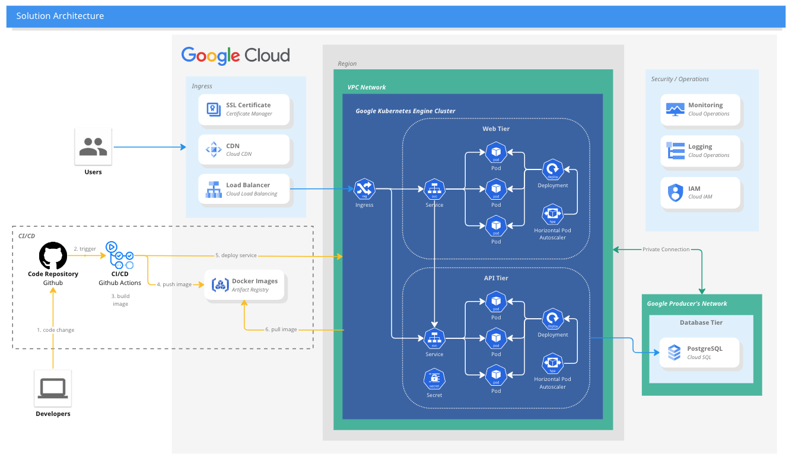

# Sample 3tier app
This repo contains code for a Node.js multi-tier application.

The application overview is as follows

```
web <=> api <=> db
```

The folders `web` and `api` respectively describe how to install and run each app.

## Architecture


## DevOps
CI/CD is using Github and Github Actions since Gitlab CI on my account is not using any Runner and I do not have permission to edit the settings.
